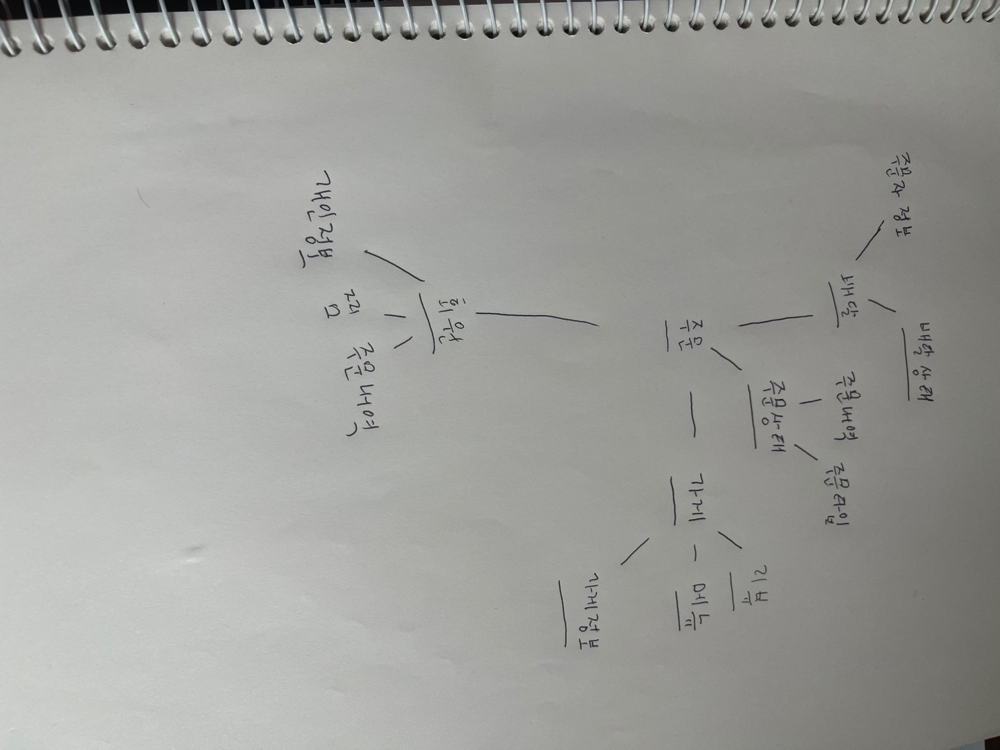

# 도메인 모델

도메인 모델의 정의는 여러개가 존재한다.

기본적으로 도메인모델은 특정 도메인을 개념적으로 표현한것이다.

예시로 배달의 민족 도메인을 구성해본다면 어떻게 될까?

임의로 작성해본 도출해본 도메인 결과이지만, 아마 실제 서비스에서는 더욱 복잡한 도메인과 세부적이게 구성되어 있을 것이다.

이때 도메인을 설계할 때, 가장 중점인 부분은 개념과 구현 모델을 구분 짓는 것이다.
개념과 구현모델은 서로 동일시 되는 원리는 아니지만, 구현모델이 개념 모델을 최대한 따르도록 설계해야한다는 점이 존재한다.

예를들어 객체지향 프로그래밍 기반인 서비스라면, 하나의 객체는 하나의 개념 모델을 구현하는 용도로 사용할 수 있다.

### 💡 하위 도메인과 모델
하나의 도메인은 다수의 하위 도메인으로 구성된다.

각 하위 도메인이 다루는 영역은 서로 다르기 떄문에 같은 용어라도 **하위 도메인마다 의미가 달라질 수 있다**

도메인에 따라 용어의미가 결정되게 되므로, 여러 하위 도메인을 하나의 다이어그램에 모델링하는 것은 지향해야한다.

모델의 각 구성요소는 특정 도메인으로 한정할 때 비로소 완전해 지기 때문에, 각 하위 도메인마다 별도의 모델을 필요로한다.